# Safety App (Android-React Native)

Safety App built using react native.

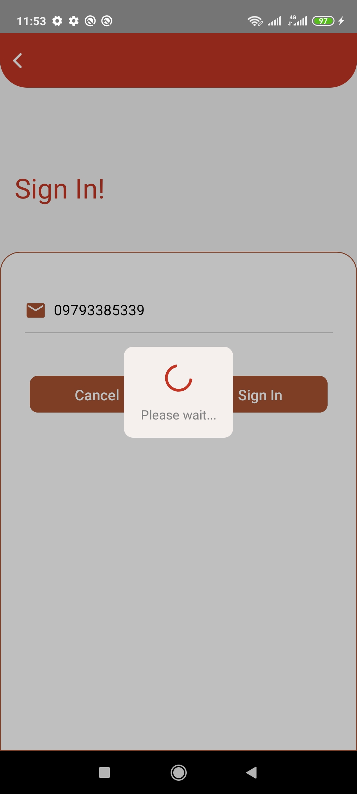

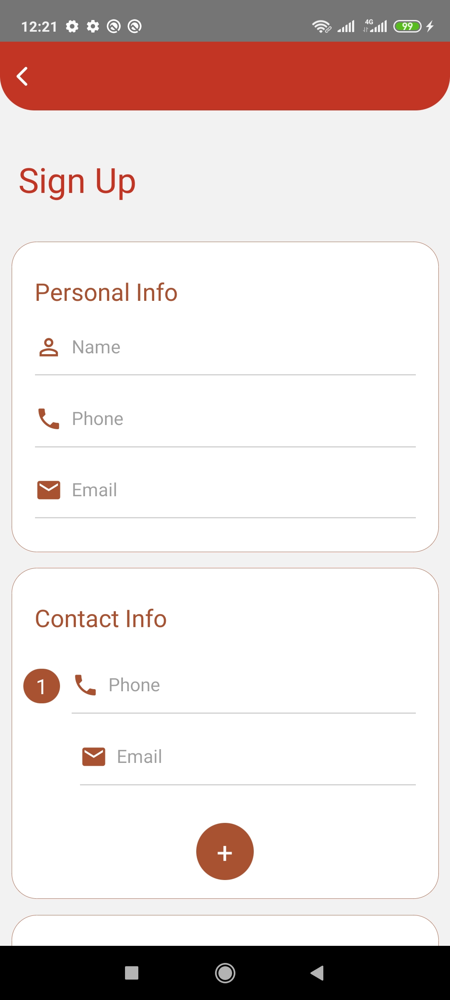
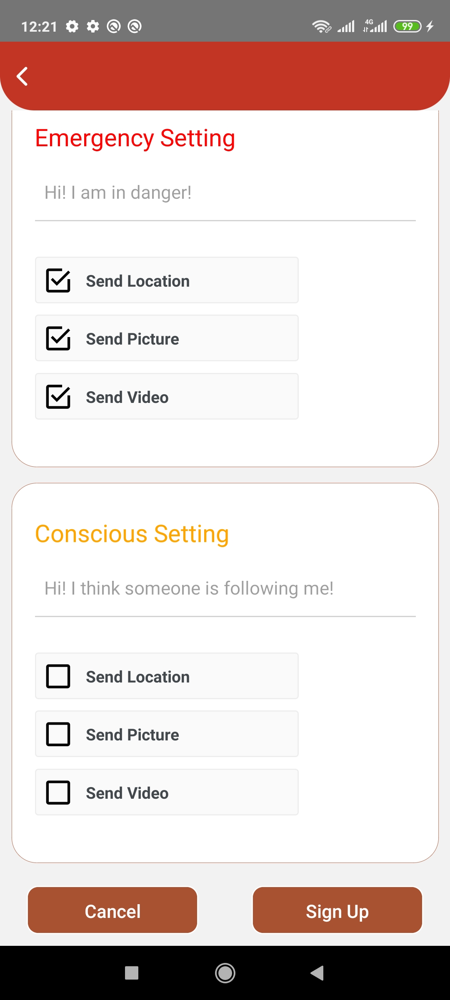
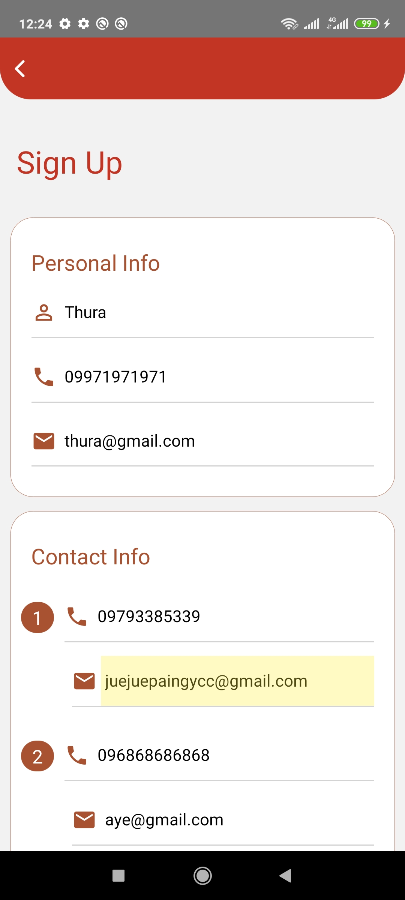
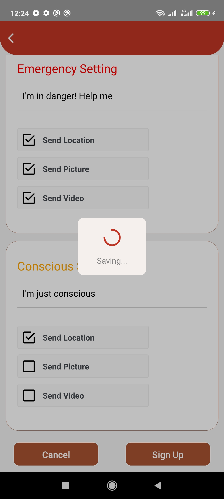

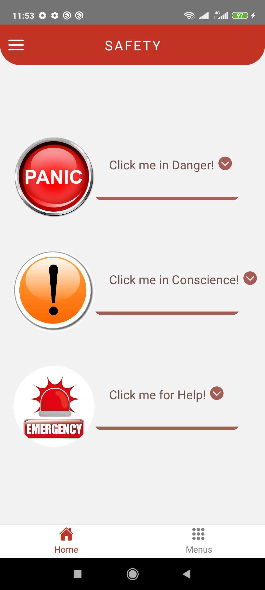
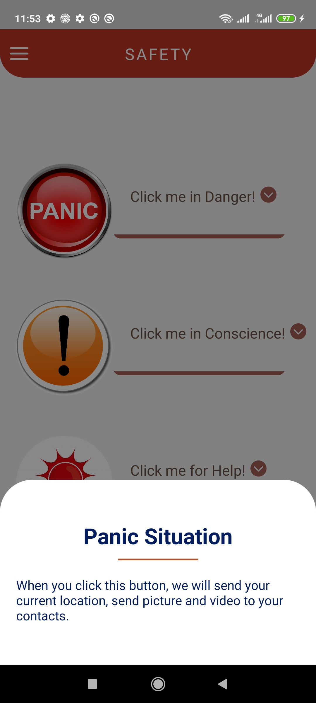
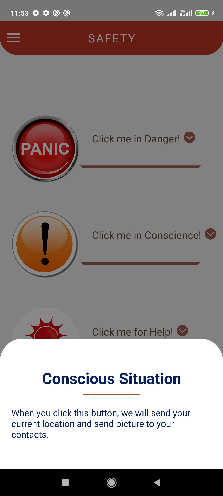
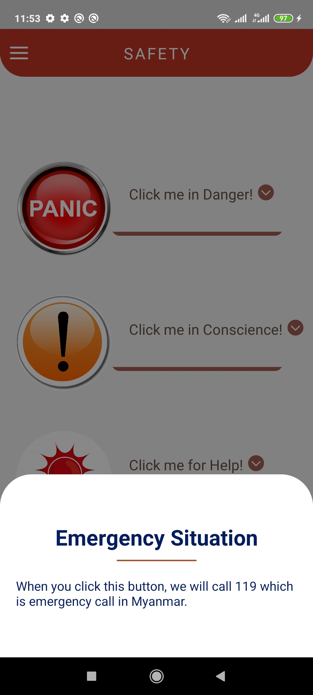

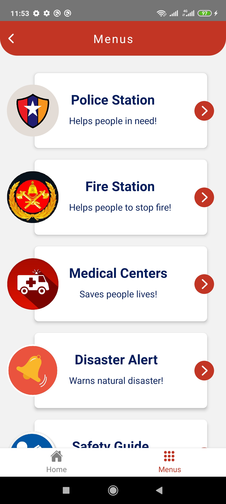
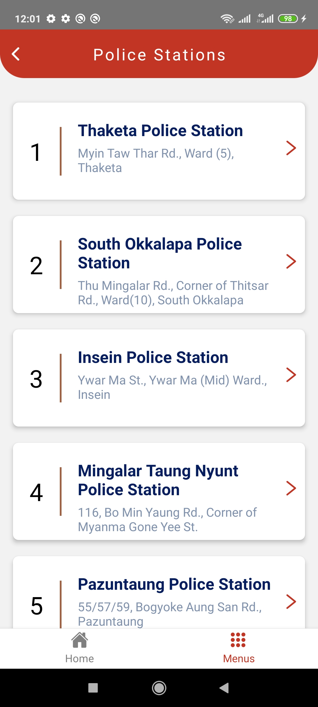
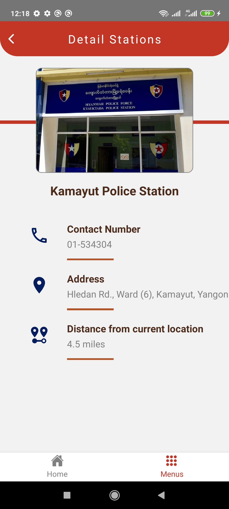

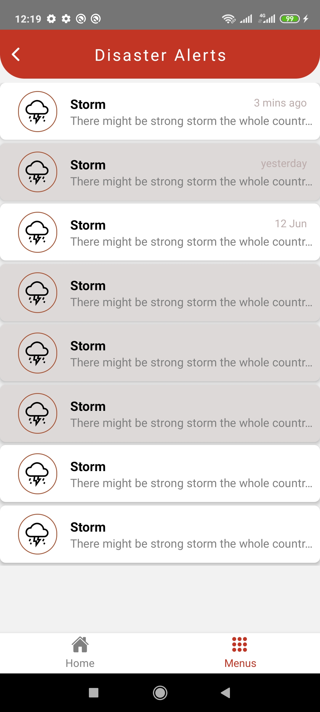
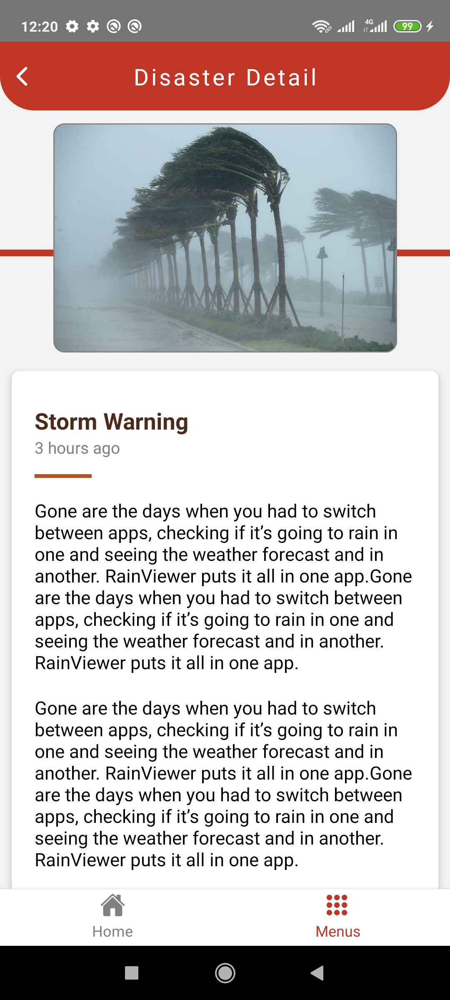
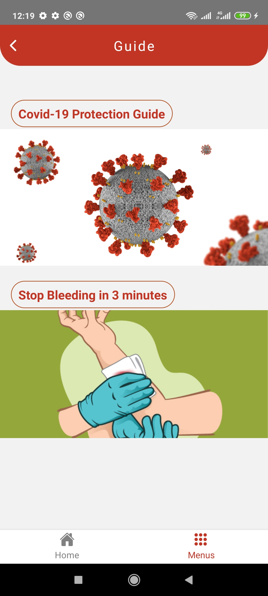

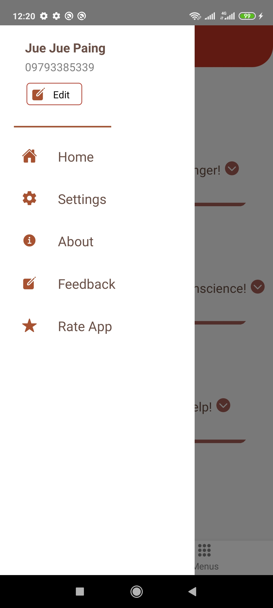
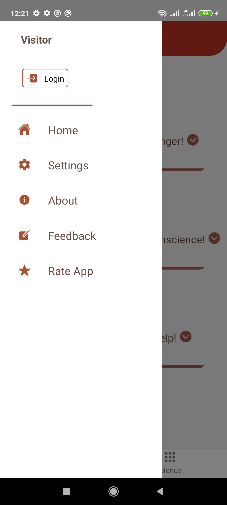
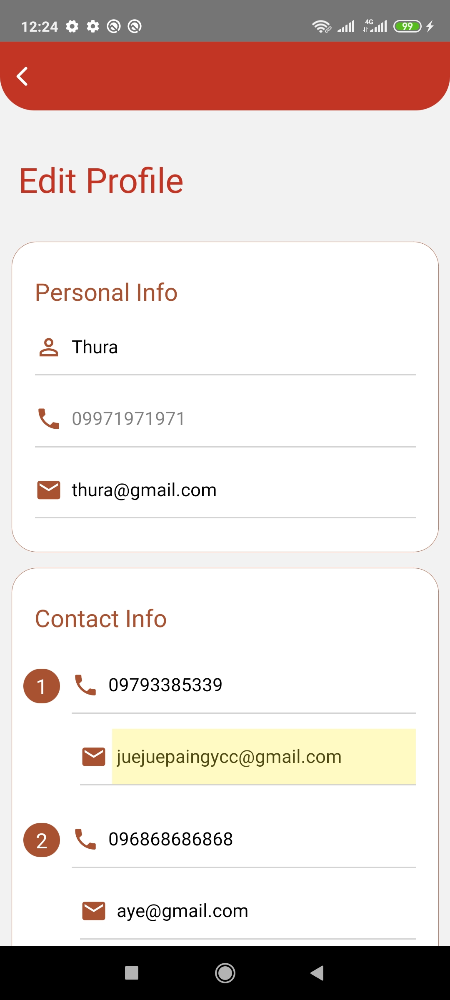

## Overview
Safety App (also called 'A Ku A Nyi') is an app which will help users in panic and conscious situations to contact their trusted friends and relatives quickly. 
Additionaly, app also contain information of police stations, fire stations, medical centres and safety guide to help user in case of emergency.

 
## Functionality 
* Register account with user's phone number and email, contact people list(1 to 3), emergency setting for panic situation and conscious setting for conscious situation (Firebase integrated)
* Login account with phone number (Firebase integrated)
* Edit user account (Firebase integrated)
* Send location, picture and video to sms and email from background to contact list in panic and conscious situation (Progressing...)
* Show phone number, address and distance of police stations, fire stations and medical centres
* Send disaster alert with notification (Progressing...)
* Show latest safety guidelines for users to stay safe

## Built With

- react native
- react-navigation 5 (Tabs + Drawer + Stack)
- react-native-vector-icons
- react-native-firebase/app & react-native-firebase/database & Firebase realtime database
- Form Validation
- Async Storage
- other stuff...

## Future Work

- Finish progressing tasks

